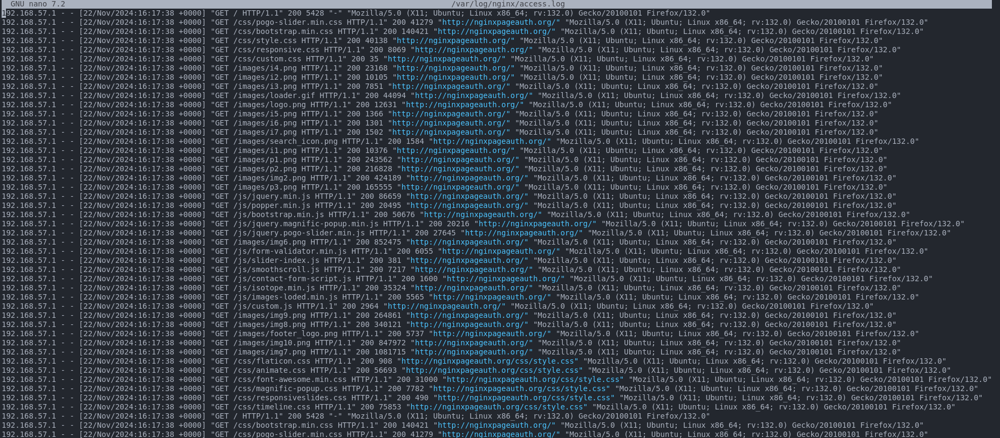
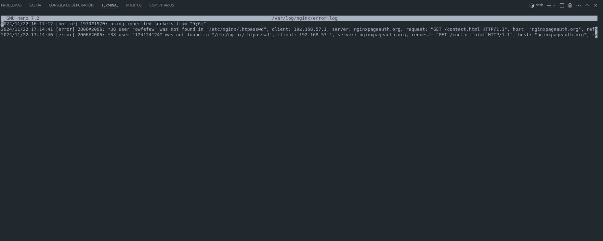

## Capturas del log 

### Para acceder al log usamos el comando 
   sudo nano /var/log/nginx/access.log

### O si queremos una vista corta
    sudo cat /var/log/nginx/acces.log
### o 

/var/log/nginx/error.log

### Si falla algo

### Mis capturas del log: 

#### Del access: 

#### Del log de error: 

